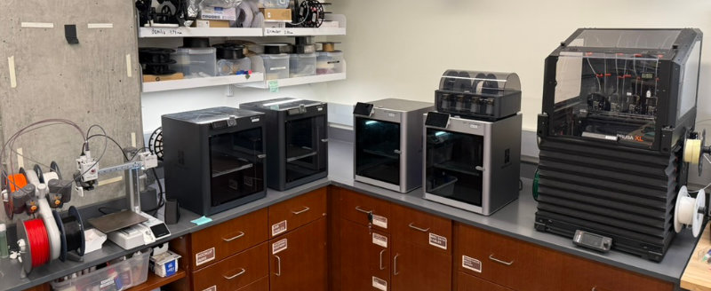
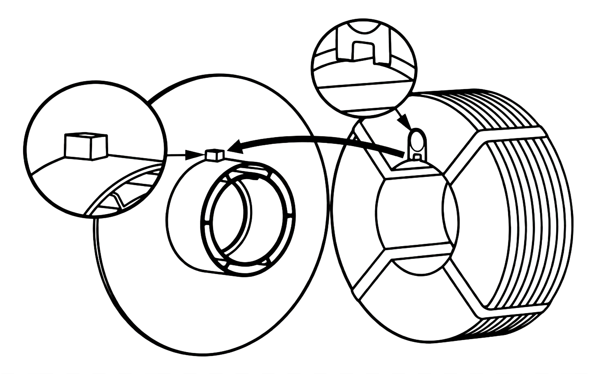

# 3D Printers

The CRB Makerspace has access to several Fused Deposition Modeling (FDM) 3D printers.

{ width = 100% }

## Hazard level

GREEN

!!! warning

    - Hot surfaces: nozzle (180-260°C) and heated bed (50-110°C) can cause severe burns
    - Moving parts can pinch or crush fingers
    - Risk of inhalation of ultrafine particles and VOCs during printing

## Safety

- **Do not touch hotend.** Print beds and nozzles can exceed 200°C. Always assume hot surfaces until printer indicates it has cooled.
- Keep hands, hair, and clothing away from moving parts. Close the printer door when running.
- **Use only approved materials.** PLA is the default; other filaments must be approved by staff due to fumes and print settings.

## Printers

| Device | Image | Resources | Notes |
| --- | --- | --- | --- |
| Bambu Lab X1 Carbon | { width="200" } | [Manual](https://wiki.bambulab.com/en/x1/manual) | High speed FDM printing. Support for up to 4 materials with AMS (but less effiecient than Prusa XL). |
| Bambu Lab P1S | { width="200" } | [Manual](https://wiki.bambulab.com/en/p1/manual) | High speed FDM workhorse. Great for general purpose prints. |
| Original Prusa XL | { width="200" } | [Manual](https://help.prusa3d.com/product/xl) | Largest print volume. Multi-material support with 5 independent printheads. |

## Materials

Parts in the CRB Makerspace are generally printed with PLA, or polylactic acid, which is a versatile, biodegradable plastic derived from renewable resources like corn starch or sugarcane. Other materials are available upon request. We usually use a 0.4mm nozzle, though smaller or larger nozzles may be available if needed for specific projects.

[The Bambu Lab filament guide](https://bambulab.com/en-us/filament/guide) provides a good high level comparison of the properties of different FDM filaments. Check with managment before using different filaments.

### Changing Filaments

**Do not change or reload filaments without authorization** — ask for assistance if a change is needed.

!!! success "Note"
    { width="500" }

    When using a refill without a spool, follow [instructions](https://www.youtube.com/watch?v=8MMZstVnBOY) carefully to prevent filament wrapping issues. **Be sure to align the spool's alignment block with the cardboard notch on the filament reel.** Bad loading has led to failed prints and wasted material.

## Guide

- Find an available printer. You can verify reservations in the scheduler below.
- Use [Bambu Studio](https://bambulab.com/en/download/studio) or [PrusaSlicer](https://www.prusa3d.com/page/prusaslicer_424/) to set up your print. **Ensure the correct printer type, material, and build plate is selected for use.**
    - Refer to the Bambu Lab [Build Plate](https://wiki.bambulab.com/en/filament-acc/acc/plates) and [Filament](https://bambulab.com/en-us/filament/guide) guides to find what is best for your application.
- Export the sliced file onto a microSD card (Bambu Lab printers) or flash drive (Prusa XL). The 3D printers must be started in person. They are not connected to the network (on purpose). 
- Scan the QR code on the printer to reserve your print time. **You must schedule the printer for every print job.** This helps us track usage and provides contact information if there are issues.
    - Long or large prints (4+ hours) should be coordinated with Raphael.
- Verify the right filament is in the printer. Ask for assistance to change filament.
- Verify the correct built plate is inserted and installed properly.
- Insert the microSD card or USB drive, select your sliced file, and start the print. 
- Ensure that the first layer prints correctly before leaving. Most failures occur on the first layer.
- Promptly remove prints when complete. **Do not use metal tools to remove parts from the print bed.** Use plastic tools instead to prevent damage to the print surfaces.
- Clean up all pieces and reinstall the build plate in the printer before leaving.
- If something seems wrong (unusual noises, smoke/odors, spaghetti print), pause the job and notify staff. [Report any issues to management](../report-issue.md); do not attempt to repair yourself.

## Schedule Printer Time

<iframe src="../../scheduler-app/index.html" width="100%" height="780" style="border:0; border-radius:12px;"></iframe>