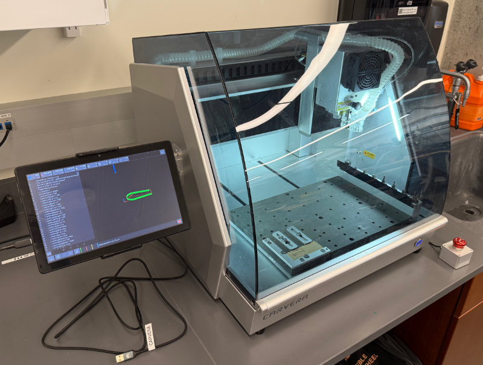

# CNC Milling Machine

{ width="600" }

The CRB Makerspace Shop has a Carvera CNC milling machine. You must complete machine-specific training before being authorized to use this machine. **Do not cut steel on this machine.**

## Hazard level

ORANGE

!!! warning

    - The Carvera is programmed to stop spindle operation when the lid is opened. **Do not change this setting or override the interlocks.** Contact with the high-speed cutting tool or flying chips and metal fragments can cause injury when the enclosure is open.
    - Part edges and chips can be sharp
    - Risk of unexpected machine movement from programming errors
    - Hot cutting tools and workpiece after operation

## Safety

- **Never leave the machine running unattended.** Hit the e-stop if anything goes wrong.
- Clear chips with brush/vacuum. Do not use your hands or compressed air.

## Getting started

The best way to get acquainted with the machine is to go through the tutorial videos provided by Makera.

[Tutorial Videos](https://wiki.makera.com/en/carvera/How-To){ .md-button .md-button--primary }

## Speeds and Feeds

**ALWAYS** confirm you are using the correct spindle speeds (in RPM), feed rate (in mm/s), and depth of cut (in mm) for your bit and material before running your program by referencing the official table from Makera!

[Speeds and Feeds Table](https://wiki.makera.com/en/speeds-and-feeds){ .md-button .md-button--primary }

## Instructions for use

- Download profiles for your CAM software of choice from Makera [HERE](https://wiki.makera.com/en/software).
    - Note: The Makerspace has a license for [Makera CAM](https://www.makera.com/pages/makera-cam) if needed. Reach out to management for details.
- Create the CAM paths for your part.

!!! warning

    Issues have been found in the speeds and feeds from the profiles for Autodesk Fusion and Kiri:Moto. Do not trust them on their own. **[Verify the speeds with the official table.](https://wiki.makera.com/en/speeds-and-feeds)**

- **Always double check your settings with the [feeds and speeds table](https://wiki.makera.com/en/speeds-and-feeds) for your bit.**
    - Make sure you are using the right tool for your material.
    - Make sure the spindle speed and feed rates are correct.
    - Make sure the tool is in the right tool position for your CAM program.
- Load your material into the Carvera. Make sure it is securely held in place with screws, clamps, and/or double-sided tape. **Make sure there is an MDF spoilboard or wasteboard underneath your part** to prevent damage to the flat bed surface.
- Make sure the correct cutting tools are in the correct tool positions. Remember that each tool requires a [bit collar](https://www.youtube.com/watch?v=J8edCDsmz8I).
- [Connect to the machine](https://www.youtube.com/watch?v=BEp7jFWM49Y) using the [Carvera Controller app](https://www.makera.com/pages/software#MakeraController) using either the Wi-Fi access point on the Carvera or the attached USB cable. Alternatively, you can use the attached tablet.
- [Load your gcode file onto the machine.](https://www.youtube.com/watch?v=2XS9p2VNVJ8)
- Run your program, being sure to set the correct work origin and Z probe position (where it will measure the Z height of your stock).
    - You can optionally enable [Auto Leveling](https://www.youtube.com/watch?v=Oq6cqfWvIls), which probes a grid of points across your stock to map surface height variations and adjusts the cut to follow them (useful for shallow work on surfaces that aren't perfectly flat or level — for example, PCB milling).
    - Be sure to keep [Scan Margin](https://www.youtube.com/watch?v=Zr-_MQViZFQ) enabled to have the machine trace out a bounding box with the laser. **Always confirm that there is no interference between the cutting tool and the mounting hardware.** The laser bounding box should help with this, but does not capture the full path of the cuts or the width of the cutting tools.
- When you are done:
    - Remove all cutting tools from the automatic tool changer (ATC) and return them to their labeled containers.
        - **Tell management about any broken or damaged cutting tools so they can be replaced.**
    - Remove your workpiece, any clamps or screws, and the MDF spoilboard you added.
    - Vacuum all chips inside and around the machine.
    - Close the enclosure and press the e-stop (to prevent remote activation). The machine does not need to be fully powered down.

## Manual

<iframe
    src="../../manuals/carvera-instruction-manual.pdf"
    width="100%"
    height="1100px"
    style="border:none;"
></iframe>