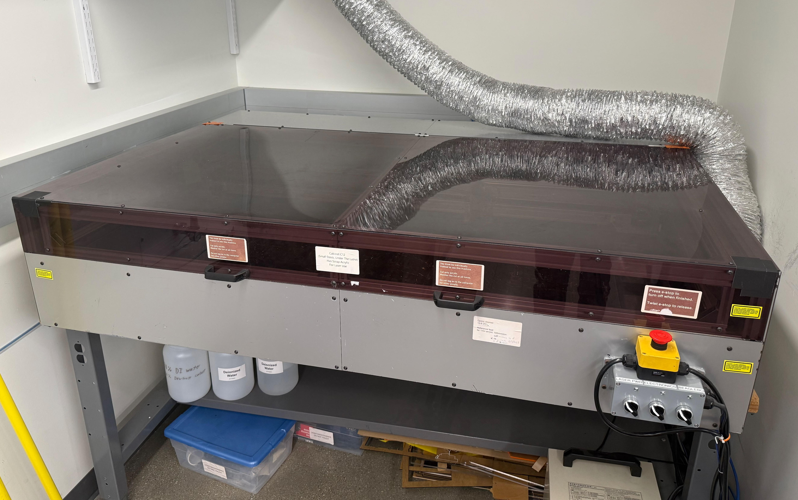

# Lasersaur Laser Cutter

{ width="600" }

The CRB Makerspace has one [Lasersaur](https://www.lasersaur.cc/) laser cutter with a work area of 1220x610mm (48x24").

## Hazard level

<span style="background-color: red; color: white; padding: 4px 8px; border-radius: 4px; font-size: 2.2em; font-weight: bold;">RED</span>

!!! warning
    
    - The Lasersaur uses a 100 W CO₂ laser contained within a Class 1 enclosure. CO₂ laser light is invisible to the eye and can cause severe eye damage or fire through direct or reflected exposure outside the enclosure.
    - **Never defeat the safety interlocks.** Doing so is dangerous and violates federal and Illinois law.
    - Fire hazard from materials igniting during cutting.
    - Toxic fume hazard from cutting the wrong materials.

## Safety

- **NEVER leave the laser cutter operating unattended.** Material may catch fire and/or the laser path may be altered or disrupted.
- The lid must always be closed when operating. The laser will turn off when the lid is opened. **Never defeat the safety interlocks.**
- Always ensure proper ventilation before starting the laser cutter. Make sure air is flowing into the exhaust vent and that there are no leaks in or around the exhaust hose.
- **The biggest risk of using the laser cutter is fire.** If you see a flame, press the e-stop and watch closely. A small flame will usually burn out on its own within a few seconds. If it does not, spray it with the water sprayer kept by the machine. If that does not extinguish it, use the fire extinguisher and/or pull the fire alarm.
- Refer to the [Northwestern University Laser Safety Manual](https://researchsafety.northwestern.edu/safety-information/laser-safety-handbook.html) for additional information.

## Training

All users of the laser cutter must complete training and sign the [Laser Cutter User Agreement](https://docs.google.com/forms/d/e/1FAIpQLScNfDLSuRgTxsmXStFUIbFBRf9WtSJh-jAURYJhVYSE5c7ZVw/viewform?usp=sharing&ouid=100806786810159707352).

<!-- To add users, run `sudo add_netid FirstName LastName nid1234` -->
<!-- Maintenance procedures documented at https://nuwildcat-my.sharepoint.com/:w:/r/personal/mle641_ads_northwestern_edu/Documents/CRB%20Laser%20Cutter%20Maintenance.docx?d=we228d654e58b4af2baba3801382cb877&csf=1&web=1&e=y1R2dq -->

## Materials

- **Only cut acrylic on this machine.** Other materials may produce toxic fumes or large amounts of particulate and soot, damage the optics, or catch fire.
- Prohibited materials include (but are not limited to): PVC/vinyl, ABS, polycarbonate/PC, foams, and any unknown material.
- **If it is not verified to be acrylic, do not cut it.**

## Recommended Settings

| Material | Thickness | Feed (mm/min) | Power (%) |
| --- | --- | --- | --- |
| Acrylic (cutting) | 1/8" / 3mm | 700 | 100% |
| Acrylic (cutting) | 1/4" / 6mm | 220 | 100% |

If the laser is not cutting all the way through the material, slow down the feed rate.

## Usage

- Log in to the Lasersaur computer. Everyone has their own login—no sharing allowed. If you cannot log in, you are not allowed to use the machine.
- Release the E-stop and turn on the Beaglebone and Electronics switches.
- Open Firefox and navigate to [`http://cutter/`](http://cutter/) (`http` not `https`). This connects you to the server running inside the Lasersaur.
- Press the Home button to home/zero the X and Y axes.
- Open the lid, place your stock material in the machine, and close the lid.
- Open your file.
- Use the Offset command to place your drawing in the correct position. Optionally, use the Move button to jog the cutting head over your stock to help with alignment.
- Select the cutting settings for your path (feed rate and power) based on the thickness of your acrylic stock.
- Turn on the laser power. Wait 30 seconds for the laser to fully power up.
- Press Run and **monitor the cut at all times.**
- When the cut is complete, wait briefly for the fumes to clear, open the lid, and remove your parts.
- When done, turn off the power switches for the Laser, Electronics, and Beaglebone, then press the E-stop to power down the system.
- Vacuum up any small debris from the work area before leaving.

## Troubleshooting

### `Error 400: Bad Request` when opening a file

This usually means the BeagleBone's storage is full. You'll need to SSH in and
clear the cached cut files.

First, connect:

```shell
ssh root@cutter
```
Then change into the cache directory and clear it:

```shell
cd ~/.driveboardapp && pwd    # the leading period matters — see note below
ls                            # confirm these are cut files, not source code
rm -r *
```

!!! warning "Important"
    
    `.driveboardapp` (with the leading period) is the **cache** while `driveboardapp` (no period) is the **application code**. Make sure you are deleting the cache and not the application code. The `pwd` and `ls` steps above are there to verify you're in the right place before running `rm`.

<!-- TODO: Automate this with a script that runs regularly -->

## Manual

Review the [Lasersaur Manual](https://github.com/nortd/lasersaur/wiki) for details.