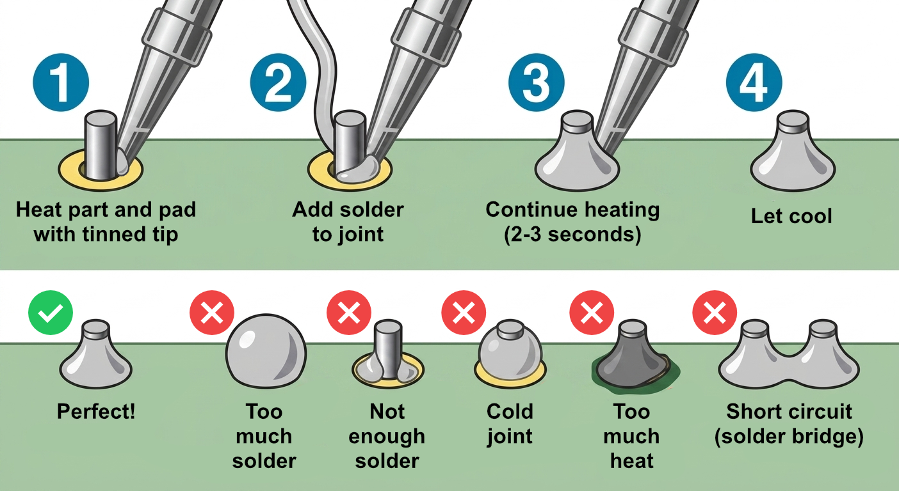

# Soldering Stations

The CRB Makerspace has Metcal MX-500P and Metcal MFR-PS1300 soldering stations, plus an Aoyue 852 hot air rework station.

## Hazard level

YELLOW

!!! warning

    - Tips reach 350–400 °C (660–750 °F) and will cause severe burns on contact
    - Solder fumes (especially from flux) are an inhalation hazard
    - Molten solder can splatter, particularly when flicking the iron or using wet sponges
    - Hot tools and freshly soldered joints can stay hot long after powering down
    - Lead-bearing solder is a contamination/ingestion hazard — wash hands after use

## Safety

- **Always wear safety glasses when soldering.** Solder and flux can pop, especially when reflowing or desoldering.
- Use the fume extractor. Position the intake within a few inches of the joint so you are not breathing in the flux fumes.
- Return the iron to its stand whenever you are not actively soldering. Never set a hot iron on the bench or work mat.
- Assume the tip is hot. Check the station display before touching, and let tips cool fully before swapping.
- Tie back long hair and keep loose sleeves clear of the iron.
- Wash your hands when you are done, especially before eating or drinking.

## Guide

The [Adafruit Guide to Excellent Soldering](https://learn.adafruit.com/adafruit-guide-excellent-soldering/making-a-good-solder-joint) provides a good overview for making good solder joints.

## Tips for good joints

{ width=100% }

- **A good joint is shiny with a concave fillet that wets up the lead and out to the pad edge.** Inspect every joint before moving on — a quick visual check (and a gentle tug on through-hole leads) catches problems while the iron is still hot and the fix is quick and easy.
- **Flux is your friend.** Flux strips oxidation off the pad and the lead so the solder can actually wet to the metal. If a joint looks dull, grainy, balled up, or sits on top of the pad without wetting out, add flux and reheat — do not just pile on more solder.
- **Use the right tip.** Bigger joints and ground planes need a larger chisel or hoof tip to deliver enough heat. Fine-pitch SMD soldering is easier with a small conical or bent tip. Turning up the temperature is not a substitute for the right tip geometry.
- **Use the right temperature.** For leaded solder (63/37 or 60/40), set the iron to 315–350°C (600–660°F). For lead-free solder, 350–380°C (660–720°F) is a sensible range. You should only need to push higher for large ground planes or wires that pull away heat. Hotter temperature with shorter contact time is better than cooler temperature with longer contact time — lower temperatures force you to linger, which cooks off flux and stresses pads.

!!! note

    Metcal irons use fixed-temperature cartridges and aren't adjustable.

- **Tin your tip.** A small amount of solder on the tip of your iron transfers heat to the joint far better than a dry point or edge contact. If there is too much solder on the tip, wipe it clean with brass wool.
- **Heat the joint, not the solder.** Touch the tip so it bridges both the pad and the lead simultaneously, with a small bit of solder on the tip at the moment of contact to act as a heat bridge. Then feed solder into the joint — not onto the iron tip. The joint itself should melt the solder, which is how you know it is hot enough to bond.
- **Keep contact short.** Keep heat on the joint long enough for the solder to flow across the pad and into any through holes, but not longer than needed. Two to three seconds is usually plenty for typical through-hole joints. Ground planes and heavy copper need longer, but get in and out as fast as the joint allows — lingering cooks the flux off, lifts pads, and can damage heat-sensitive components like ICs, LEDs, and connectors.
- **Stabilize your parts.** Tack one pin in place before soldering the others. This holds your component in place and lets you verify pin alignment — if it's off, reflow that pin and adjust the component before continuing. For through-hole components, you can bend the leads slightly on the back of the board to hold the part flush. Many cold joints trace back to the joint moving while the solder solidifies, not to heat or flux.
- **Regularly clean the tip as you work.** Wipe the tip on brass wool to clean it. A black, crusty tip will not transfer heat well.
- **Clean off flux residue.** It is best to clean off flux using 99% Isopropyl Alcohol (IPA) and a stiff brush and immediately absorb the dissolved residue with a lint-free wipe (e.g. Kimwipes).
- **Store the iron tinned.** When you are done, leave a fresh blob of solder on the tip before shutting down. This protects the tip from oxidation between sessions and dramatically extends tip life.

## Through-hole soldering example video

<iframe
    width="360"
    height="640" 
    src="https://www.youtube.com/embed/nPz37an_7ng?si=y6BBWBvpx8GN57zd&amp;start=16" 
    title="YouTube video player" frameborder="0" 
    allow="accelerometer; autoplay; clipboard-write; encrypted-media; gyroscope; picture-in-picture; web-share" 
    referrerpolicy="strict-origin-when-cross-origin" 
    allowfullscreen></iframe>

## SMD soldering example video

<iframe
    width="360"
    height="640"
    src="https://www.youtube.com/embed/qd8y-bnLycU?si=Ai4kSzoZ9Qgtkyoq"
    title="YouTube video player"
    frameborder="0"
    allow="accelerometer; autoplay; clipboard-write; encrypted-media; gyroscope; picture-in-picture; web-share" referrerpolicy="strict-origin-when-cross-origin"
    allowfullscreen></iframe>